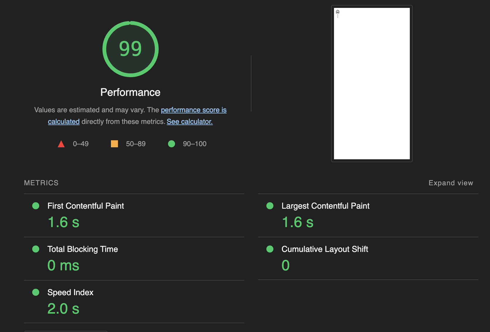
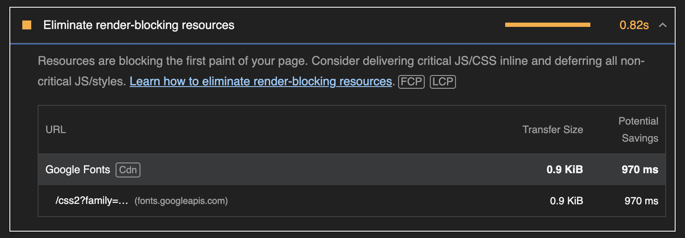
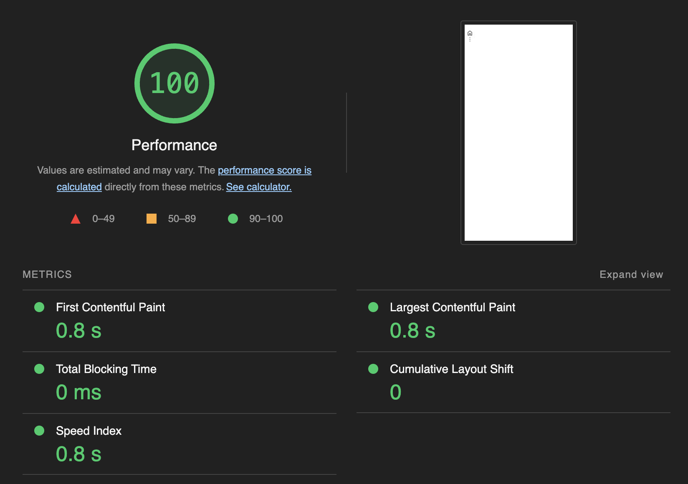

# rollup-plugin-material-symbols
> It's a saying that material icon/symbol font is slow, this resolves that.

## install
```sh
npm i -D rollup-plugin-material-symbols
```

## example

### svg

[src](./test/src/svg)

[result](./test/exports/svg)

[config](./test/rollup.config.js)

#### index.html
```html
<!DOCTYPE html>
<html lang="en">
<head>
  <meta charset="UTF-8">
  <meta name="viewport" content="width=device-width, initial-scale=1.0">
  <title>Document</title>
</head>
<body>
  <span style="display: none;">
    <template name="home">@symbol-home</template>
    <template name="more_vert">@symbol-more_vert</template>
  </span>

  <test-icon>home</test-icon>
  <test-icon>more_vert</test-icon>
  <script src="./icon.js" type="module"></script>
</body>
</html>
```
#### icon.js
```js
class Icon extends HTMLElement {
  get iconTemplateContent() {
    return document.querySelector(`template[name="${this.innerHTML || this.getAttribute('icon')}"]`).content
  }

  get iconTemplateTextContent() {
    return this.iconTemplateContent.cloneNode(true).children[0].outerHTML
  }

  constructor() {
    super();
    this.attachShadow({mode: 'open'});
  }

  connectedCallback() {
    super.connectedCallback && super.connectedCallback();
    this.shadowRoot.innerHTML = this.render();
  }

  render() {
    const html = (...strings) => {
      return strings.reduce((set, value) => set += value.join ? value.join('') : value , '')
    };
    return html`
      <style>
        :host {
          --custom-icon-size: 24px;
          display: block;
          height: var(--custom-icon-size);
          width: var(--custom-icon-size);
        }
      </style>

      ${this.iconTemplateTextContent}
    `
  }
}

customElements.define('test-icon', Icon);

export { Icon };

```

#### rollup config

```js
import {materialSymbolsSvg} from 'rollup-plugin-material-symbols'
export default {
  input: ['src/svg/icon.js'],
  output: [{
    dir: 'exports/svg',
    format: 'es'
  }],
  plugins: [
    materialSymbolsSvg({
      includeHTML: true, // ./exports/**/*.html
      copyHTML: true, // './src/**/*.html'
      customTheme: false
    })
  ]
}
```

## why?
### font



### svg (inline...)

